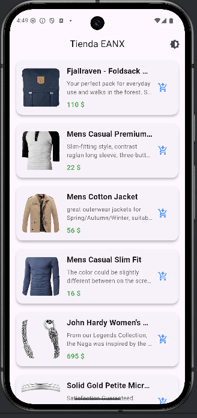
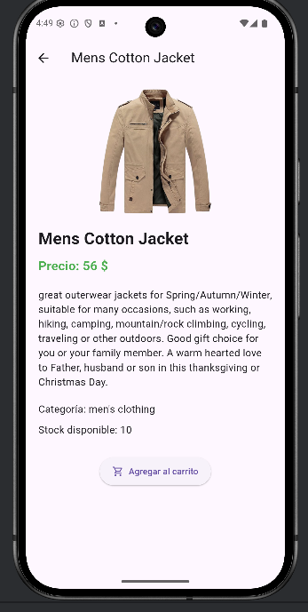

# 🛍️ Flutter Store App
Aplicación móvil desarrollada en **Flutter**, que implementa un catálogo de productos consumidos desde una **API REST** utilizando **DIO**. Incluye navegación, temas claro/oscuro, manejo de errores, arquitectura Repository + Service y pantalla de detalle.

Este proyecto forma parte de prácticas academicas, pero está estructurado como una aplicación real lista para portafolio.

---

## 🚀 Funcionalidades principales
- ✅ Listado de productos desde API  
- ✅ Vista de detalles con imagen, precio, categoría y stock  
- ✅ Cambio de tema (modo claro/oscuro)  
- ✅ Arquitectura modular con Repository Pattern  
- ✅ Consumo de API externa (FakeStoreAPI)  
- ✅ Manejo de assets locales como fallback  
- ✅ Código limpio, ordenado y fácil de mantener  

---

## 📁 Estructura del proyecto
```plaintext
lib/
├── models/
│ └── product.dart
├── pages/
│ ├── home_page.dart
│ └── product_detail_page.dart
├── repository/
│ └── product_repository.dart
├── services/
│ └── api_service.dart
├── widgets/
│ └── product_card.dart
└── main.dart

assets/
├── data/
│ └── productos.json
└── images/
 └── laptop.png
 └── audifonos.jpg
 └── reloj.png
```
---

## 📌 Importante: ¿Por qué no se incluyen las carpetas nativas (android, ios, web)?

Para mantener el repositorio:

✅ más limpio  
✅ más ligero  
✅ enfocado en **Dart** y la arquitectura del proyecto  
✅ con 100% del lenguaje detectado como Dart en GitHub  

Las carpetas nativas son generadas automáticamente por Flutter y **NO son necesarias en el repositorio**, a menos que el proyecto use SDK nativos específicos (no es el caso).

---
## 📄 Modelo de datos


**Patrones aplicados:**
- Repository Pattern
- Separación lógica por responsabilidades
- Uso de servicios externos (DIO)
- Modelo sólido para productos (Product)

---

## 🔌 API utilizada
**FakeStore API**  
https://fakestoreapi.com/products

Usada para obtener:
- título
- descripción
- precio
- categoría
- imagen desde URL

---

## 📸 Capturas de pantalla

### 🏠 Pantalla principal (Listado)


### 📄 Pantalla detalle



---

## 🚀 Instalación y ejecución

Sigue estos pasos para clonar y ejecutar el proyecto correctamente en cualquier dispositivo (Android, iOS, Web o Desktop).

### 1️⃣ Clonar el repositorio

```bash
git clone https://github.com/ma-sarmiento/Ecommerce_App
cd Ecommerce_App
```

### 2️⃣ Instalar Dependencias
```bash

flutter pub get
```

### 3️⃣ Regenerar Carpetas Nativas
```bash
flutter create .
```

### 4️⃣ Ejecutar el Proyecto
```bash
flutter run
```
---

📦 Dependencias principales
```plaintext
dio: ^5.4.0
intl: ^0.18.0
cupertino_icons: ^1.0.8
```
---

🌙 Modo claro / oscuro
El proyecto incluye un interruptor en la AppBar que permite cambiar de tema dinámicamente.

---

💡 También puedes abrirlo directamente desde  Android Studio previamente configurado para flutter y compilar con un solo clic.

---

>  Nota: Por razones de derechos académicos, el enunciado original del proyecto **no será publicado en este repositorio**.
